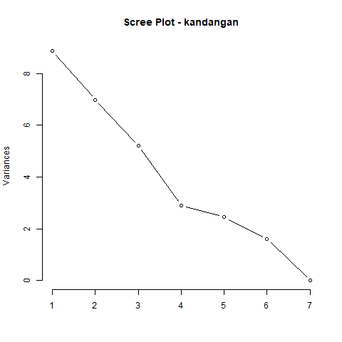
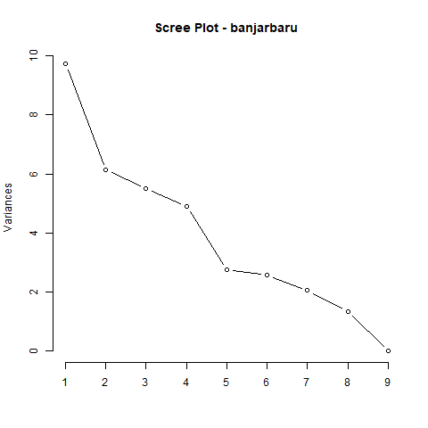
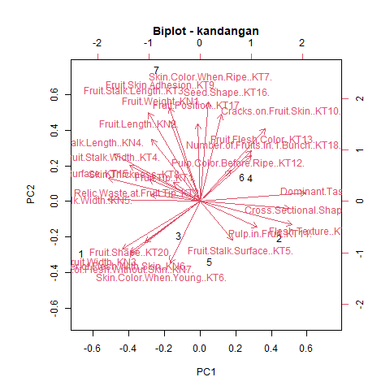
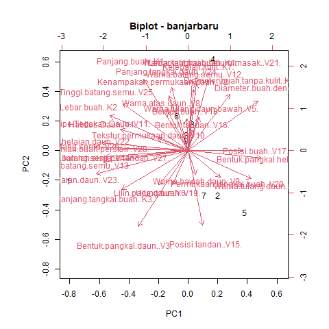
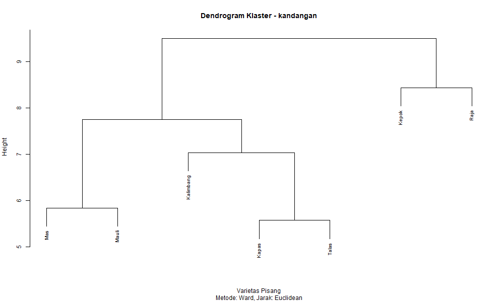
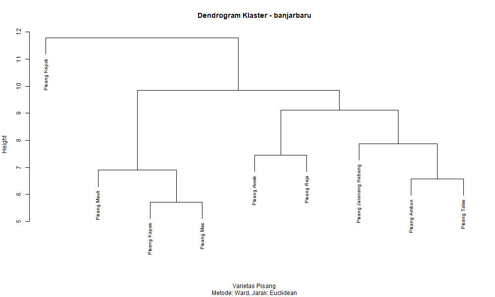
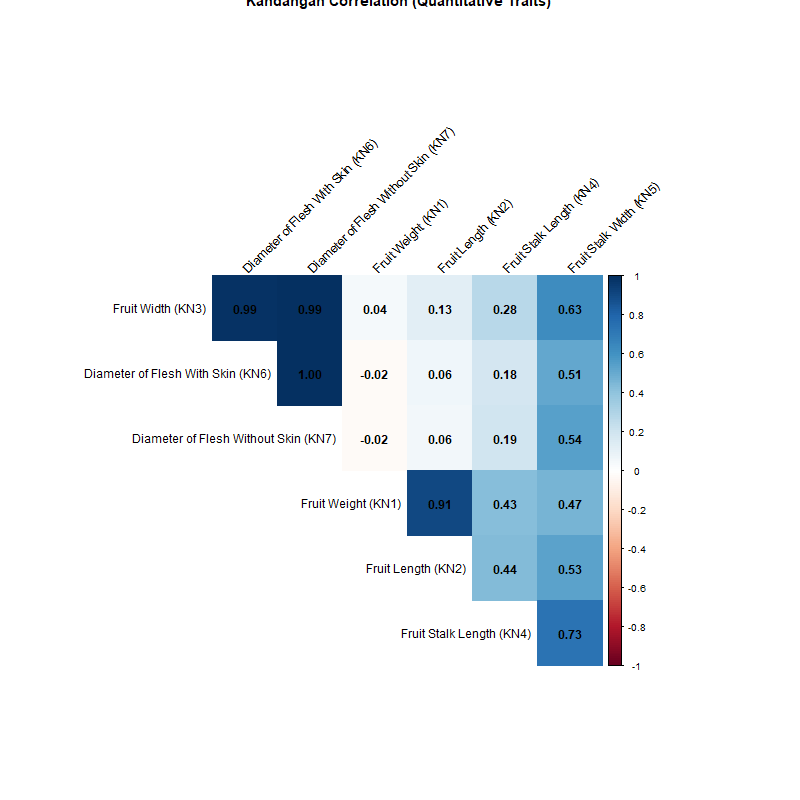
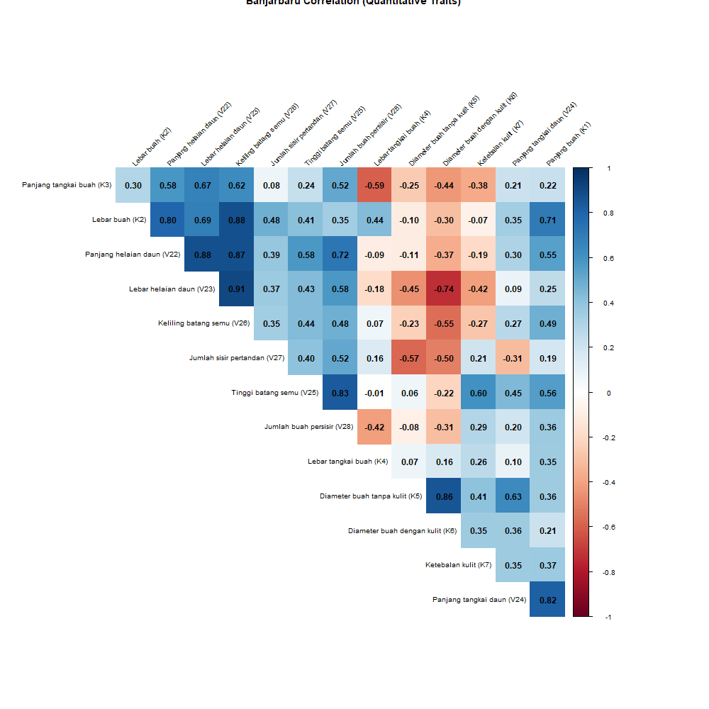

# ANALISIS MORFOLOGI DAN MOLEKULER KERAGAMAN GENETIK PISANG LOKAL KALIMANTAN SELATAN

Check out `data/` for the raw data. Mostly in `.csv`. My plan for this thesis is:

- Standardize the data [DONE]
- PCA [DONE (With Rev)
- Hierachical categorization [DONE (With Rev)]
- Pearson correlation
- Discriminant analysis
- Sequence analysis
- Multiple Alignment
- Genetic diversity index
- Mantel test

---

## Morphological Analysis Results

This section has the main findings from the R analysis scripts. All output tables are in `results/` and plots are in `results/plots/`.

### 1. Principal Component Analysis (PCA)

PCA was super useful for simplifying the data.

* **Kandangan:** The first 3 components (PC1-PC3) explain **75.2%** of all variation.
* **Banjarbaru:** The first 4 components (PC1-PC4) explain **75.1%**.

You can see the "elbow" on the scree plots:

**Key Findings (from the `_pca_loadings.csv` tables):**

* **Kandangan:** The main differences between samples (PC1) are driven by **taste, flesh texture, and fruit shape** (`KT14`, `KT20`).
* **Banjarbaru:** The main differences (PC1) are driven by the **plant's overall size** (leaf length, leaf width, and stem circumference - `V22`, `V23`, `V26`).

The biplots visualize this, showing which samples cluster together.

### 2. Hierarchical Clustering

This shows which varieties are morphologically most similar.

**Key Findings:**

* **Kandangan:** "Ambon" and "Mas" are grouped very closely. "Raja" and "Kepok" seem to be the most unique/different.
* **Banjarbaru:** "Pisang Kepok" and "Pisang Kapas" are a close pair. "Pisang Talas" is the most different from all the others.

### 3. Correlation

This shows which quantitative traits are related. The heatmaps give a quick visual, with dark blue = strong positive correlation.

**Key Findings (from the `_correlation_matrix.csv` tables):**

* **Kandangan:** Confirmed a very strong link (0.91) between **Fruit Weight (KN1)** and **Fruit Length (KN2)**. Longer bananas are heavier.
* **Banjarbaru:** Confirmed strong links (>0.87) between **leaf length (V22), leaf width (V23), and stem circumference (V26)**. Bigger plants have bigger parts.

### 4. Discriminant Analysis (LDA)

**Status:** Failed.
**Reason:** The analysis stopped itself because the data isn't structured for it.
* **Kandangan:** All rows had at least one missing `NA` value.
* **Banjarbaru:** Only one sample was present for each variety (e.g., 1 "Pisang Ambon", 1 "Pisang Kepok"). LDA needs multiple samples in a group to work.

This wasn't an error... it's just that LDA isn't suitable for this specific dataset. (TODO: Ask my prof about this)
